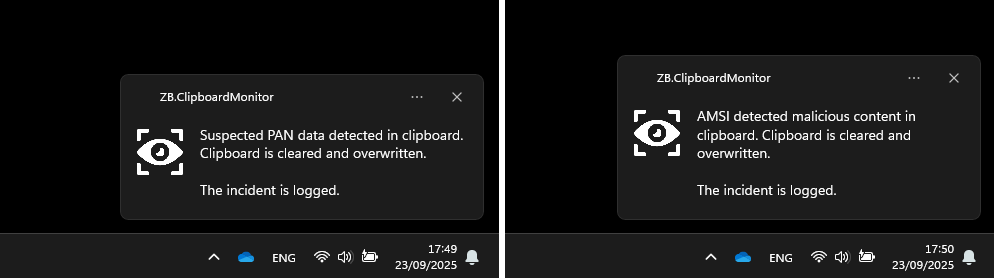

# ClipboardMonitor

[](https://github.com/zbalkan/ClipboardMonitor/actions/workflows/msbuild.yml)

ClipboardMonitor is a Windows background utility focused on **clipboard abuse detection** and **payment-card data loss prevention (DLP)**.



## What it does

ClipboardMonitor monitors clipboard text and can:

- Detect suspicious command/script tokens (for example: `powershell`, `mshta`, `cmd`, `msiexec`, and toast-notification API terms).
- Submit suspicious text to **AMSI** (Antimalware Scan Interface) for an antivirus verdict.
- Detect payment-card PAN candidates (using brand checks + Luhn validation), then **mask** and **replace** clipboard content.
- Correlate risky clipboard activity with suspicious launch behavior (for example, **Win + R** or **Win + X -> I** within a 30-second window).
- Log incidents asynchronously to the **Windows Event Log**.
- Notify users with a Windows toast.

## How detection works (high level)

1. Clipboard text changes are observed.
2. Browser-originated text is evaluated for risky malware-related keywords.
3. PAN-like values are evaluated against known card-brand rules and checksum validation.
4. Confirmed risky content triggers AMSI scan and/or DLP masking behavior.
5. Follow-on user actions are correlated and surfaced through logs + toast notifications.

## Requirements

- Windows (WPF + WinForms interop)
- .NET Framework **4.8.1**
- Administrator rights only for install/uninstall of the Event Log source

## Installation

ClipboardMonitor writes to the Windows Event Log. Registering the log source requires elevation.

1. Open an **elevated** PowerShell or Command Prompt.
2. Run:

   ```powershell
   ClipboardMonitor -i
   ```

   Supported install flags: `-i`, `/i`, `--install`

3. Start `ClipboardMonitor.exe` normally.
4. (Optional) Add it to Startup or Task Scheduler.

## Uninstallation

Run in an **elevated** shell:

```powershell
ClipboardMonitor -u
```

Supported uninstall flags: `-u`, `/u`, `--uninstall`

## CLI usage

```text
USAGE: ClipboardMonitor [ARGUMENTS]

-i, /i, --install      Register Windows Event Log source (Admin required)
-u, /u, --uninstall    Remove Windows Event Log source (Admin required)
-?, -h, /h, --help     Show help message
```

## Operational notes

- Risky keyword evaluation is focused on clipboard text copied from common browsers.
- PAN DLP behavior can still apply outside browser-copy scenarios.
- Runtime execution does **not** require elevation after initial Event Log source setup.
- Correlation window for follow-on launch behavior is **30 seconds**.

## Safety warning

ClipboardMonitor runs safely as a standard user process.

There is an optional `ENABLE_CRITICAL_PROCESS` block in the codebase (commented out by default). If enabled, forcibly terminating the process can trigger a Windows bugcheck (`CRITICAL_PROCESS_DIED`). Keep this disabled during normal development and testing.

## Development

- Solution: `src/ClipboardMonitor.sln`
- Main app: `src/ClipboardMonitor` (WPF app with some WinForms components)
- Tests: `src/ClipboardMonitor.Tests`

Open the solution in Visual Studio with the **.NET Desktop Development** workload installed.

## Acknowledgements

- **Tim MalcomVetter** for [UnstoppableService](https://github.com/malcomvetter/UnstoppableService), which inspired parts of the bootstrap approach (this project is not installed as a Windows service).
- **Gérald Barré (Meziantou)** for the [Using Windows AMSI in .NET article](https://www.meziantou.net/using-windows-antimalware-scan-interface-in-dotnet.htm).
- **Eric Lawrence** for ClipShield and his [attack-techniques article](https://textslashplain.com/2024/06/04/attack-techniques-trojaned-clipboard/).

## Icon attribution

[Monitoring icons created by smashingstocks - Flaticon](https://www.flaticon.com/free-icons/monitoring)
